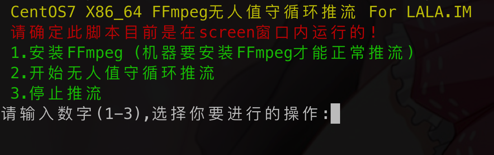

# 前提条件
- `centos7.x`机器
- `bilibili`直播用买国内服务器(推荐阿里云或腾讯云)
- youtube直播买海外服务器(推荐aws)


# 初始化
```
sudo yum install git
git clone https://github.com/lantron-ltd/stream-live.git
cd stream-live
sudo chmod +x init.sh
sudo ./init.sh
```

# 安装直播推流软件
```
screen -S youtube
sudo chmod +x youtube.sh
./youtube.sh
```

选`1`，然后`yes`安装

# Youtube开始直播
把视频放在`/home/centos/video`下后执行脚本
```
sudo ./youtube.sh
```

选`2`，把直播推流地址填进去进行下一步，填写要直播的视频地址:`home/centos/video`，如果机器CPU性能一般不要开水印

```
rtmp://a.rtmp.youtube.com/live2/你的youtube直播码
```

# 去直播界面确认
确实没问题之后取消和screen的关联，再开一个终端
```
screen -list

```


bilibili操作同上
